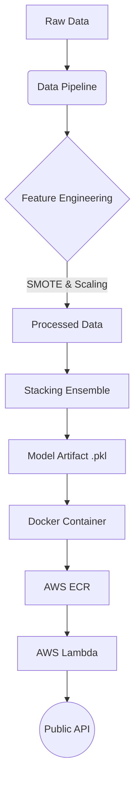

# Student Dropout and Academic Success Prediction (V2)

### 🚀 [View Live Demo / Working Prototype](https://Sasaank79.github.io/Serverless-Student-Success-Prediction-System/)
*(Click above to test the deployed model)*

## Project Overview
This project implements a production-grade Machine Learning pipeline to predict student dropout and academic success using the [UCI Predict Students' Dropout and Academic Success dataset](https://archive.ics.uci.edu/ml/datasets/Predict+Students'+Dropout+and+Academic+Success).

**V2 Updates**:
- **Advanced Feature Engineering**: Interaction ratios and semester aggregations.
- **Class Imbalance Handling**: SMOTE applied to training data.
- **Stacking Ensemble**: Combines XGBoost, LightGBM, and CatBoost with a Logistic Regression meta-learner.
- **AWS Lambda Support**: Dockerfile and guide for serverless deployment.
- **Input Validation**: Strict Pydantic validation for API inputs.

## Architecture



## Key Results
- **Best Model**: Hyper-Tuned Stacking Ensemble
- **Accuracy**: **77.54%**
- **F1-Score**: **0.7724**
- **ROC-AUC**: **0.8579**

## Project Structure
- `data/`: Dataset storage (raw and processed_v2)
- `src/`: Source code
    - `data/`: Data loading
    - `features/`: Feature engineering (`advanced_features.py`)
    - `models/`:
        - `train_pipeline.py`: **Unified Training Pipeline**
        - `experiments/`: Legacy experiments and individual model scripts
    - `api/`: FastAPI application with validation
- `notebooks/`: Exploratory Data Analysis
- `reports/`: Generated figures and plots
- `tests/`: Unit and integration tests

## Setup & Usage

### Prerequisites
- Python 3.9+
- Docker (optional)

### Installation
1. Clone the repository
2. Install dependencies:
   ```bash
   pip install -r requirements.txt
   ```

### Running the Pipeline (V2)
1. **Download Data**:
   ```bash
   python3 src/data/make_dataset.py
   ```
2. **Process Data (V2)**:
   ```bash
   python3 src/features/advanced_features.py
   ```
3. **Train & Package (Unified Pipeline)**:
   ```bash
   python3 src/models/train_pipeline.py
   ```
   *This script loads data, optimizes hyperparameters, trains the stacking ensemble, evaluates it, saves the artifact, and prints deployment instructions.*

### API Deployment
1.  **Run Locally**:
    ```bash
    uvicorn src.api.main:app --reload
    ```
2.  **Deploy to AWS Lambda (Docker)**:
    -   See [aws_deployment.md](aws_deployment.md).

### 🌍 Frontend Demo
This project includes a simple HTML/JS frontend (`index.html`) to interact with the live API.

**How to use:**
1.  **Locally**: Simply double-click `index.html` to open it in your browser.
2.  **Online**: If deployed to GitHub Pages, visit `https://YOUR_USERNAME.github.io/Student-Success-AI/`.

*Note: The frontend connects to the AWS Lambda URL configured in the JS code.*
